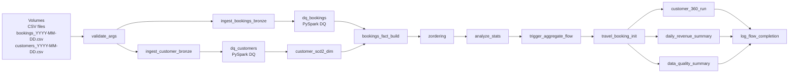

# Travel Booking SCD2 Merge Pipeline

End-to-end **data engineering pipeline** built on **Databricks (GCP)** that ingests daily travel-booking and customer feeds, validates them with **native PySpark data-quality checks**, applies **SCD Type-2** logic on the customer dimension, and builds a partitioned **booking fact** table — all on **Delta Lake** following the **Medallion (Bronze → Silver → Gold) architecture**, orchestrated as **two chained Databricks Workflows**.


## Table of Contents

- [Overview](#overview)
- [Architecture](#architecture)
- [Tech Stack](#tech-stack)
- [Project Structure](#project-structure)
- [Catalog Layout (Unity Catalog)](#catalog-layout-unity-catalog)
- [Data Model](#data-model)
- [Pipeline Stages](#pipeline-stages)
- [Workflow Orchestration](#workflow-orchestration)
- [Live Execution — Proof of Run](#live-execution--proof-of-run)
- [Setup](#setup)
- [How to Run](#how-to-run)
- [Sample Analytics Queries](#sample-analytics-queries)
- [Key Concepts Demonstrated](#key-concepts-demonstrated)
- [Troubleshooting](#troubleshooting)
- [Roadmap](#roadmap)
- [License](#license)

---

## Overview

This project simulates a real-world **travel booking platform** where:

- **Customer master data** changes over time (address change, email update, name correction). Those changes must be **historised** so analysts can answer *"what did this customer's profile look like on a given date?"*.
- **Booking transactions** arrive daily and are aggregated into a clean fact table joined with the correct historical customer version (via surrogate keys).
- Every load is **idempotent**, **audited**, and **gated** by data quality checks before downstream tables are touched.

The pipeline is fully parameterised by `arrival_date`, so it can be backfilled or scheduled for any business date.

---

## Architecture



**Medallion layers in this project**

| Layer  | Schema                       | What lives here                                                              |
| ------ | ---------------------------- | ---------------------------------------------------------------------------- |
| Bronze | `travel_bookings.bronze`     | Raw appended ingests with audit columns (`ingestion_time`, `business_date`)  |
| Silver | `travel_bookings.default`    | Cleaned, modelled tables — `customer_dim` (SCD2), `booking_fact`             |
| Gold   | `travel_bookings.analytics`  | Business views and aggregates — `customer_360`, `daily_revenue_by_type`      |
| Ops    | `travel_bookings.ops`        | `run_log`, `dq_results`, `dq_daily_summary`, `workflow2_run_log`             |

---

## Tech Stack

- **Compute & orchestration:** Databricks on GCP (Databricks Runtime 17.3 LTS, Apache Spark 4.0), Databricks Workflows, Serverless SQL Warehouse (for the Gold workflow)
- **Storage & format:** Delta Lake on Unity Catalog Volumes
- **Languages:** PySpark, Spark SQL
- **Data quality:** Native PySpark aggregations (no third-party DQ library)
- **Source control:** Git Folders (Repos) in Databricks; notebooks committed in Databricks `.py` source format

---

## Project Structure

```
Travel_bookings_SCD2_Merge_Project/
├── travel_booking_scd2_project/
│   ├── notebooks/                        # Databricks .py source format
│   │   ├── validate_inputs.py            # Param + file validation, run_log bootstrap
│   │   ├── 10_ingest_bookings_bronze.py  # CSV -> bronze.booking_inc
│   │   ├── 11_ingest_customers_bronze.py # CSV -> bronze.customer_inc (SCD2-ready)
│   │   ├── 20_dq_bookings.py             # Native PySpark DQ checks on bookings
│   │   ├── 21_dq_customers.py            # Native PySpark DQ checks on customers
│   │   ├── 30_customer_dim_scd2.py       # SCD Type-2 MERGE on customer_dim
│   │   ├── 31_booking_fact_build.py      # Build booking_fact + surrogate-key join
│   │   ├── 40_optimize_zorder.py         # OPTIMIZE ... ZORDER BY + VACUUM
│   │   └── 41_analyze_stats.py           # ANALYZE TABLE for CBO
│   └── queries/                          # Spark SQL files used by Workflow 2
│       ├── travel_booking_init.sql       # Schemas + workflow2_run_log
│       ├── customer360.sql               # Gold view: customer 360
│       ├── daily_revenue.sql             # Gold table: revenue by booking_type
│       ├── data_quality_summary.sql      # Ops: daily DQ rollup
│       └── log_completion_flow.sql       # Workflow completion logging
├── sample_data/                          # Sample CSVs for local / demo runs
│   ├── booking_data/
│   │   └── bookings_YYYY-MM-DD.csv
│   └── customer_data/
│       └── customers_YYYY-MM-DD.csv
├── docs/
│   └── screenshots/                      # Proof-of-run screenshots (see below)
├── .gitignore
├── LICENSE
└── README.md
```

> **Note:** Notebooks are committed in Databricks **`.py` source format** (each file begins with `# Databricks notebook source`). Databricks Git Folders import these back into runnable notebooks automatically — they show as notebooks in the workspace, and as plain Python in GitHub, so diffs and code review are clean.

---

## Catalog Layout (Unity Catalog)

After a successful run, the `travel_bookings` catalog looks like this:

```
travel_bookings/
├── analytics/        (Gold)
│   ├── customer_360                  ← view
│   └── daily_revenue_by_type         ← table
├── bronze/           (Bronze)
│   ├── booking_inc
│   └── customer_inc
├── default/          (Silver)
│   ├── booking_fact
│   └── customer_dim                  ← SCD2
├── ops/              (Operations)
│   ├── dq_daily_summary
│   ├── dq_results
│   ├── run_log
│   └── workflow2_run_log
└── default/data/     (Volume — landing zone for source CSVs)
```


*Catalog Explorer view of the `travel_bookings` catalog with bronze / default / analytics / ops schemas and a sample of the `booking_fact` table.*

---

## Data Model

### Source files

**`bookings_YYYY-MM-DD.csv`**
`booking_id, customer_id, booking_date, amount, booking_type, quantity, discount, booking_status, hotel_name, flight_number`

**`customers_YYYY-MM-DD.csv`**
`customer_id, customer_name, customer_address, phone_number, email, valid_from, valid_to`

### Silver: `customer_dim` (SCD Type 2)

| Column             | Type    | Notes                                              |
| ------------------ | ------- | -------------------------------------------------- |
| `customer_sk`      | BIGINT  | Surrogate key, `GENERATED ALWAYS AS IDENTITY`      |
| `customer_id`      | INT     | Natural key from source                            |
| `customer_name`    | STRING  | Tracked attribute                                  |
| `customer_address` | STRING  | Tracked attribute                                  |
| `email`            | STRING  | Tracked attribute                                  |
| `valid_from`       | DATE    | Effective start of this version                    |
| `valid_to`         | DATE    | `9999-12-31` for current row, else closed-out date |
| `is_current`       | BOOLEAN | Flag for the active version                        |

### Silver: `booking_fact`

| Column               | Type   | Notes                                                |
| -------------------- | ------ | ---------------------------------------------------- |
| `booking_type`       | STRING | Flight / Hotel / etc.                                |
| `customer_id`        | INT    | Natural key                                          |
| `customer_sk`        | BIGINT | FK to `customer_dim` (current version at load time)  |
| `business_date`      | DATE   | Daily grain                                          |
| `total_amount_sum`   | DOUBLE | `SUM(amount - discount)`                             |
| `total_quantity_sum` | BIGINT | `SUM(quantity)`                                      |

### Ops: `dq_results`

Every DQ check writes one row here so failures can be inspected and trended over time.

| Column          | Type      |
| --------------- | --------- |
| `business_date` | DATE      |
| `dataset`       | STRING    |
| `check_name`    | STRING    |
| `status`        | STRING    | `Success` / `Error`
| `constraint`    | STRING    | Human-readable rule, e.g. `amount >= 0`
| `message`       | STRING    |
| `recorded_at`   | TIMESTAMP |

---

## Pipeline Stages

### 1. Validate inputs — `validate_inputs.py`
Reads widget params (`arrival_date`, `catalog`, `schema`, `base_volume`), verifies that the day's CSVs exist on the Volume, and writes a `STARTED` row to `ops.run_log`.

### 2. Bronze ingestion — `10_*` and `11_*`
CSV reads with header + schema inference, augmented with `ingestion_time` and `business_date`, appended to `bronze.booking_inc` and `bronze.customer_inc`.

### 3. Data quality — `20_*` and `21_*`
**Native PySpark** DQ — no third-party library. A single aggregation pass uses `F.count(F.when(...))` to count violations per rule, results are written to `ops.dq_results`, and the notebook **raises `ValueError` if any check has status `Error`** so downstream tasks don't run on bad data.

Checks performed:

| Dataset        | Rules                                                                                  |
| -------------- | -------------------------------------------------------------------------------------- |
| `booking_inc`  | `row_count > 0`, `customer_id IS NOT NULL`, `amount IS NOT NULL`, `amount >= 0`, `quantity >= 0`, `discount >= 0` |
| `customer_inc` | `row_count > 0`, `customer_name IS NOT NULL`, `customer_address IS NOT NULL`, `email IS NOT NULL` |

This approach is intentionally lightweight: it runs in a single Spark job per dataset, has zero install footprint, and is fully compatible with **Spark 4.0 / DBR 17.x** (where PyDeequ is not currently supported).

### 4. SCD2 customer dimension — `30_customer_dim_scd2.py`
Two-step pattern:
1. `MERGE` to **close** existing current rows whose tracked attributes changed (set `valid_to = s.valid_from`, `is_current = false`).
2. `INSERT` new current versions for those changed customers, plus brand-new customers. Surrogate key is auto-generated by Delta IDENTITY.

### 5. Booking fact — `31_booking_fact_build.py`
Joins bronze bookings to current `customer_dim` rows to attach `customer_sk`, aggregates to daily grain by `(booking_type, customer_sk, customer_id, business_date)`, and **MERGEs** into `booking_fact` so reruns are idempotent.

### 6. Optimisation — `40_*` and `41_*`
`OPTIMIZE ... ZORDER BY` on common predicates, `VACUUM`, and `ANALYZE TABLE COMPUTE STATISTICS` so the cost-based optimiser has fresh stats.

### 7. Gold / SQL workflow — `queries/*.sql`
A second Databricks Workflow runs the SQL files on a **Serverless Starter Warehouse** to (re)build the analytics views and ops summaries, then logs completion to `ops.workflow2_run_log`.

---

## Workflow Orchestration

The pipeline runs as **two chained Databricks Workflows**:

### Workflow 1 — `travel_booking_data_processing_flow`
Runs the notebook pipeline end-to-end (Bronze → Silver), then triggers Workflow 2.

```
validate_args
   ├── ingest_bookings_bronze
   │       └── dq_bookings ─┐
   └── ingest_customer_bronze
           └── dq_customers ┤
                            ├── customer_scd2_dim
                            │       └── bookings_fact_build
                            │               ├── zordering
                            │               └── analyze_stats
                            │                       └── trigger_aggregate_flow
```

### Workflow 2 — `travel_booking_aggregation_flow`
Runs the SQL pipeline (Gold / Analytics) on a Serverless SQL Warehouse.

```
travel_booking_init
   ├── customer_360_run
   ├── daily_revenue_summary
   └── data_quality_summary
        └── log_flow_completion
```

`trigger_aggregate_flow` is a "Run Job" task at the end of Workflow 1 that fires Workflow 2 only on Workflow 1's success — so the Gold layer is rebuilt only against fresh, DQ-validated Silver data.

---

## Live Execution — Proof of Run

The screenshots below come from the actual deployed pipeline running on Databricks GCP.

### Both workflows registered


*Databricks Jobs & Pipelines page showing both workflows: `travel_booking_data_processing_flow` (notebooks) and `travel_booking_aggregation_flow` (SQL).*

### Workflow 1 — successful run


*Run details of `travel_booking_data_processing_flow` for `arrival_date=2025-09-23` — completed in **11m 4s**, status **Succeeded**, on `cluster_demo` (single-node `c3-standard-4-lssd`, DBR 17.3.10 / Spark 4.0).*

### Workflow 1 — task DAG


*Full task graph of Workflow 1 — every task succeeded: `validate_args` → bronze ingestions → DQ → `customer_scd2_dim` → `bookings_fact_build` → `zordering` → `analyze_stats` → `trigger_aggregate_flow`.*

### Workflow 2 — task DAG


*Full task graph of Workflow 2 (Gold) — `travel_booking_init` → fan-out to `customer_360_run`, `daily_revenue_summary`, `data_quality_summary` → fan-in to `log_flow_completion`. Total duration **1m 26s** on a Serverless SQL Warehouse.*

---

## Setup

### Prerequisites

- A Databricks workspace on **GCP** (Standard or Premium) with **Unity Catalog** enabled.
- A cluster on **Databricks Runtime 17.3 LTS** or newer (Spark 4.0, Delta Lake 3.x with identity columns). A single-node cluster is enough for this dataset.
- Permissions to create catalogs, schemas, tables, and Volumes.
- A **Serverless SQL Warehouse** for Workflow 2.

> **No extra libraries required.** Data quality runs on native PySpark, so there's nothing to `pip install` and no JARs to attach to the cluster.

### One-time setup

```sql
CREATE CATALOG IF NOT EXISTS travel_bookings;
CREATE SCHEMA  IF NOT EXISTS travel_bookings.default;
CREATE SCHEMA  IF NOT EXISTS travel_bookings.bronze;
CREATE SCHEMA  IF NOT EXISTS travel_bookings.analytics;
CREATE SCHEMA  IF NOT EXISTS travel_bookings.ops;

CREATE VOLUME  IF NOT EXISTS travel_bookings.default.data;
```

Upload the source CSVs to the Volume:

```
/Volumes/travel_bookings/default/data/booking_data/bookings_YYYY-MM-DD.csv
/Volumes/travel_bookings/default/data/customer_data/customers_YYYY-MM-DD.csv
```

---

## How to Run

### Option A — clone the repo as a Databricks Git Folder
1. In Databricks, open **Workspace → Repos → Add Repo** and paste this repo's URL. The `.py` source files import as runnable notebooks automatically.
2. Open `validate_inputs` and set widgets (Run → Edit widgets):
   ```
   arrival_date = 2025-09-23
   catalog      = travel_bookings
   schema       = default
   base_volume  = /Volumes/travel_bookings/default/data
   ```
3. Run the notebooks in numerical order, or let the Workflow do it.

### Option B — orchestrate with Databricks Workflows
Use the two-workflow design shown above:
1. Create **`travel_booking_data_processing_flow`** with one task per notebook, mirroring the DAG in [Workflow 1](#workflow-1--travel_booking_data_processing_flow). Add a final **Run Job** task (`trigger_aggregate_flow`) pointing to Workflow 2.
2. Create **`travel_booking_aggregation_flow`** with one SQL-file task per query, mirroring [Workflow 2](#workflow-2--travel_booking_aggregation_flow). Run it on a Serverless SQL Warehouse.
3. Pass `arrival_date` as a Workflow 1 parameter; it propagates to Workflow 2 via the trigger task.

---

## Sample Analytics Queries

```sql
-- Current view of every customer (latest SCD2 version only)
SELECT *
FROM travel_bookings.default.customer_dim
WHERE is_current = TRUE;

-- Point-in-time: what did customer 1007 look like on 2024-01-01?
SELECT *
FROM travel_bookings.default.customer_dim
WHERE customer_id = 1007
  AND DATE('2024-01-01') BETWEEN valid_from AND valid_to;

-- Daily revenue split by booking type
SELECT business_date, booking_type, total_amount, total_quantity
FROM travel_bookings.analytics.daily_revenue_by_type
ORDER BY business_date DESC, total_amount DESC;

-- Top 10 lifetime customers
SELECT customer_id, customer_name, SUM(lifetime_amount) AS total_spent
FROM travel_bookings.analytics.customer_360
GROUP BY customer_id, customer_name
ORDER BY total_spent DESC
LIMIT 10;

-- Today's DQ posture
SELECT *
FROM travel_bookings.ops.dq_daily_summary
WHERE business_date = current_date();

-- Recent DQ failures (root-cause investigation)
SELECT business_date, dataset, check_name, constraint, message, recorded_at
FROM travel_bookings.ops.dq_results
WHERE status = 'Error'
ORDER BY recorded_at DESC
LIMIT 50;
```

---

## Key Concepts Demonstrated

- Medallion architecture on Delta Lake (Bronze / Silver / Gold).
- **SCD Type-2** with surrogate keys via Delta `GENERATED ALWAYS AS IDENTITY`.
- Idempotent **Delta `MERGE`** for both dimension and fact loads.
- **Native PySpark** data-quality framework — single-pass aggregations, results persisted to `ops.dq_results`, pipeline gating via raised exceptions.
- Parameterised, reusable notebooks driven by Databricks **widgets**.
- **Run-log** + **DQ-log** tables for observability and auditability.
- Performance tuning via `OPTIMIZE ... ZORDER BY`, `VACUUM`, and `ANALYZE TABLE`.
- **Two-stage orchestration** with Databricks Workflows — notebook job triggers SQL job.
- Source control with **Databricks Git Folders** + `.py` source format for clean diffs.
- **Spark 4.0 / DBR 17.x** compatibility throughout — no legacy library lock-in.

---

## Troubleshooting

| Symptom                                              | Likely cause                                         | Fix                                                                  |
| ---------------------------------------------------- | ---------------------------------------------------- | -------------------------------------------------------------------- |
| `FileNotFoundError` from `validate_inputs`           | CSV for that `arrival_date` not on the Volume        | Upload the file or pass a date that exists                           |
| `ValueError: DQ failed for ...`                      | One or more checks in `dq_bookings` / `dq_customers` returned `Error` | Query `ops.dq_results` filtered to today to see which constraint failed and why |
| `customer_dim` has duplicates per `customer_id`      | Multiple "current" rows because step-1 close failed  | Re-run `30_customer_dim_scd2.py` for that date; verify `is_current`  |
| `booking_fact` rows have `customer_sk = NULL`        | Booking arrived before its customer was loaded       | Run `11_ingest_customers_bronze` + `30_customer_dim_scd2` first      |
| Identity column error on `CREATE TABLE`              | DBR too old or Delta < 3.0                           | Use DBR 13.3 LTS+ (this project is built on DBR 17.3 LTS)            |
| Workflow 2 never triggers                            | `trigger_aggregate_flow` task missing or misconfigured | Add a "Run Job" task at the end of Workflow 1 pointing at Workflow 2 |

---

## Roadmap

- Convert bronze ingestion to **Auto Loader** for streaming file detection.
- Migrate to **Delta Live Tables** with built-in expectations (a natural successor to the current PySpark DQ layer).
- Add **Lakehouse Monitoring** on `customer_dim` and `booking_fact`.
- CI with `pytest` + `chispa` for transformation logic.
- **Databricks Asset Bundles** (`databricks.yml`) for environment-aware deploys (dev / stg / prd).

---

## License

Released under the [MIT License](LICENSE).
